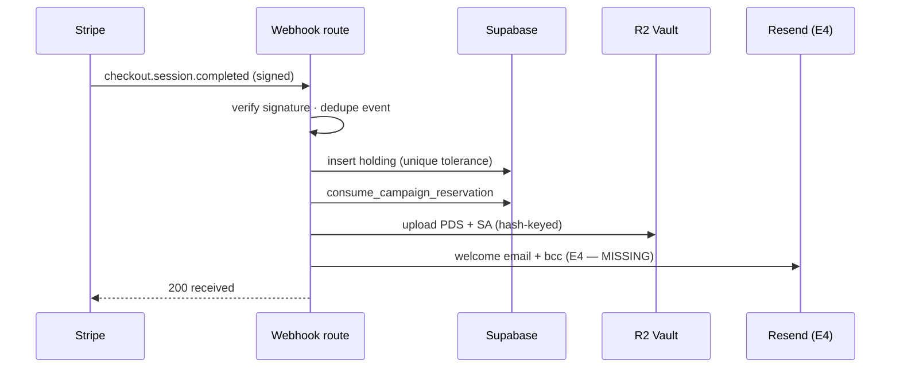

# Service Blueprint — Investor Flows (Login · KYC · Purchase)

**Status:** Phase-2 deliverable (IA & Service Blueprinting). Companion to `investor-flows-report.md`.
**Date:** 2026-09-01
**Format:** NNGroup-style blueprint — time-based columns, layered rows, three divider lines (Interaction / Visibility / Internal Interaction).
**Source of truth:** evo_02 code (verified 2026-09-01) · investor-flows-report.md · e3-flow-map.md

---

## Flow A — Investor Login

| | 1. Redirect | 2. Authenticate | 3. Return |
|---|---|---|---|
| **TIME** | ~1s | 10–60s | ~1s |
| **EVIDENCE** | Login page (dot-grid, gold lockup) | Google consent (evolutionstables.nz) · password form | Destination page (next) |
| **CUSTOMER JOURNEY** | Clicks restricted action → redirected to sign-in | Clicks Google pill OR enters email+password | Lands back where they started |
| ── **LINE OF INTERACTION** ── | | | |
| **FRONTSTAGE** | `/auth/login?next=…` renders | Google pill → `/api/auth/google` · password → Supabase `signInWithPassword` | Session established |
| **TECHNOLOGY** | — | Google OAuth (app-mediated, CSRF+nonce) · Supabase Auth | — |
| ── **LINE OF VISIBILITY** ── | | | |
| **BACKSTAGE** | `safeNextPath` validates `next` | Token exchange → `signInWithIdToken` | `handle_new_user` trigger → profile `kyc_status='unverified'` |
| ── **LINE OF INTERNAL INTERACTION** ── | | | |
| **SUPPORT PROCESSES** | — | Google Identity · Supabase Auth | Supabase `profiles` table |

**Fail points:** OAuth error path drops `next` (callback → `/login?error=…`) — fix queued · password path shows raw Supabase messages (7 codes mapped, password unmapped) — fix queued.

---

## Flow B — Investor KYC

| | 1. Trigger | 2. Initiate | 3. Verify | 4. Resolve |
|---|---|---|---|---|
| **TIME** | ~1s | ~1s | 1–5 min | ~1s |
| **EVIDENCE** | KYC badge (MyStable) | Stripe Identity page | ID + biometric check | Status badge update |
| **CUSTOMER JOURNEY** | Hits verified-only action with `kyc_status ≠ verified` | Clicks "Verify identity" | Submits ID + selfie | Sees verified / re-verify path |
| ── **LINE OF INTERACTION** ── | | | | |
| **FRONTSTAGE** | **Exists in production (evo_01/02_website) — port to evo_02** (Firebase → Supabase): `/auth/verify` + `/marketplace/[id]/kyc-processing` | **Exists in production — port** | Stripe Identity hosted flow | **Exists in production — port** (5 states: verified/pending/requires_input/canceled/none) |
| **TECHNOLOGY** | — | — | Stripe Identity (automated, no human review) | — |
| ── **LINE OF VISIBILITY** ── | | | | |
| **BACKSTAGE** | `requireVerifiedKyc` → 403 `KYC_REQUIRED` (checkout only) | — | — | Update `kyc_status` + `kyc_verified_at` |
| ── **LINE OF INTERNAL INTERACTION** ── | | | | |
| **SUPPORT PROCESSES** | Supabase `profiles.kyc_status` | Stripe Identity | Stripe Identity | Supabase · Mission Control (models full state) |

**Fail points:** entire frontstage row exists in production but not evo_02 — this is the KYC **port** gap (DoD gap 1) · badge collapses `pending`/`rejected` into "Unverified" — labels queued · `rejected` enum vs production `requires_input` — reconcile at port.

---

## Flow C — Investor Purchase

| | 1. Choose | 2. Accept | 3. Checkout | 4. Pay | 5. Own |
|---|---|---|---|---|---|
| **TIME** | 1–3 min | 2–5 min | ~1s | 1–3 min | seconds–days |
| **EVIDENCE** | Stake box, 5 pillars, live NZD pricing | Gate modal: PDS + SA, SHA-256 hashes | Stripe redirect | Stripe hosted page | MyStable holding · welcome email (E4) · vault docs |
| **CUSTOMER JOURNEY** | Picks stake % (stepper+input) | Scrolls PDS/SA, ticks 2 boxes | Clicks pay | Enters card | Reads email, views holding |
| ── **LINE OF INTERACTION** ── | | | | | |
| **FRONTSTAGE** | RightRail renders (⚠️ slider → stepper rework queued) | Gate modal renders | `create-session` route | Stripe Checkout | MyStable tabs |
| **TECHNOLOGY** | `pricingForUnits` (×1.05 ×1.03, GST-incl) | legal_engine compiled pack | Auth → KYC → reserve RPC → Stripe session | Stripe Checkout | Webhook: sig → holding → consume → R2 → email (E4) |
| ── **LINE OF VISIBILITY** ── | | | | | |
| **BACKSTAGE** | — | — | `requireVerifiedKyc` · `reserve_campaign_shares` (15-min TTL, step-units) | — | `persistCompletedCheckout`: hash match → insert holding → consume reservation → R2 vault |
| ── **LINE OF INTERNAL INTERACTION** ── | | | | | |
| **SUPPORT PROCESSES** | legal_engine · horses-data | legal_engine hashes | Supabase RPC · Stripe API | Stripe | Stripe webhook · Supabase · R2 · **Resend (E4, missing)** |

**Fail points:** cancel-stake loss — **RESOLVED: units in `cancel_url`** (Option A) · login redirect also drops stake (`next` = pathname only, `right-rail.tsx:271-272`) — fix queued with Option A · E4 email + bcc missing (webhook tail exists) · transfer facilitation not in code ("standard fees apply", TBD) · min bound hardcoded 1.0, must read `min_stake_pct` · kill switch `PURCHASES_ENABLED` (stays false until sandbox signoff).

---

## Flow C — Webhook tail (sequence)

---

## Reading the blueprints

1. **Flow B's frontstage row = the KYC port gap** — exists in production (evo_01/02_website), missing in evo_02. Port, don't rebuild.
2. **Every fail point is a build item** — the fail-points rows are the engineering backlog in disguise.
3. **Flow C's only async handoff is the webhook tail** — the sequence diagram covers what the table can't.
4. **E4 (Resend) is the only support process with no implementation** — everything else in the support rows exists.
